## 安装

### vite及react框架安装

`npm install vite@latest`

选项：

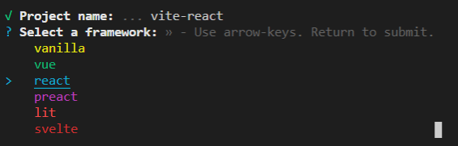

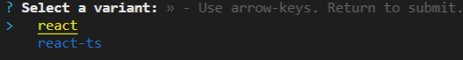

安装完成：

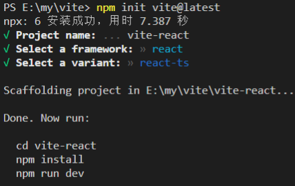

> 1. Project name：项目名称，也是文件夹名
> 2. Select a framework：选择框架，目录中有vue及react，其他的没见过，相关模板框架结构[访问这里](https://github.com/vitejs/vite/tree/main/packages/create-vite )
> 3. Select a variant：选择js/ts版本

目录结构：

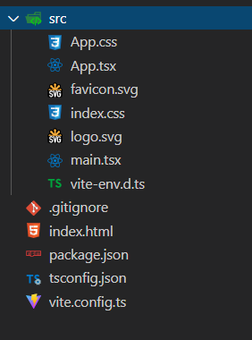

vite.config.ts：配置文件，相关参数[访问这里](https://cn.vitejs.dev/config/) 

没有了public文件夹，index.html与src文件夹同级了。可以自定义一个[public文件夹](https://cn.vitejs.dev/guide/assets.html#the-public-directory)

### 安装相关依赖

进入 vite-react目录，安装相关依赖

`npm install`

### 启动

`npm run dev`

运行如图：

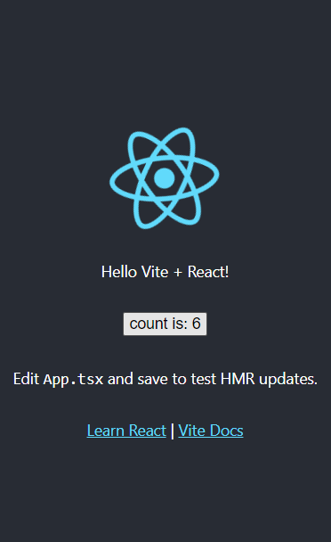

查看运行环境：

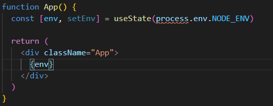

发现`process`红色波浪线，按照提示安装`@types/node`，此包包含Node.js的类型定义。

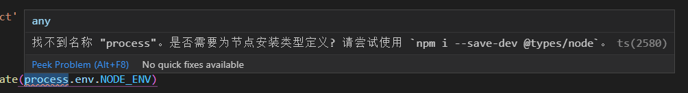

`npm i --save-dev @types/node`

重新打开vscode，红色波浪线消失，

### 打包

`npm run build`

看看目录结构：

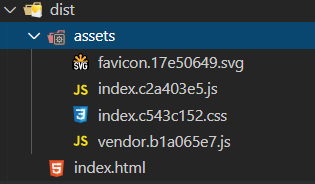

js、css、图片全都在一个assets文件夹下。

看看html文件：

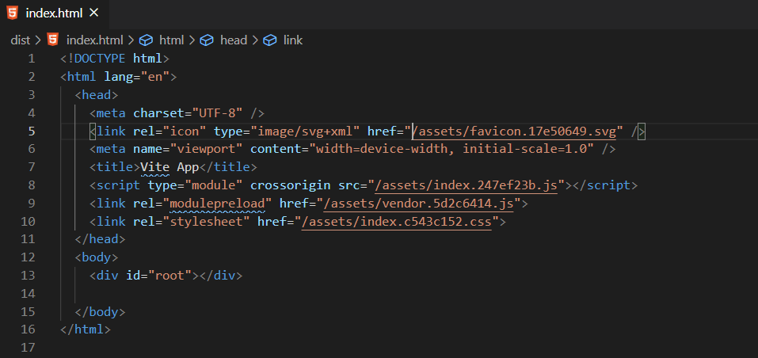

相关的一些引入全是`/assets`开头，如果不是放在服务器根目录，这样我们看到的就是空白页面，所以要修改配置文件`vite.config.ts`

```javascript
export default defineConfig({
  base:'./'
})
```

**再次打包的时候发现，dist文件夹并没有像vue-cli或umijs那样删除dist文件夹，然后重新打包，而是直接修改对应为文件，大大的增加了打包速度**

添加base配置后：

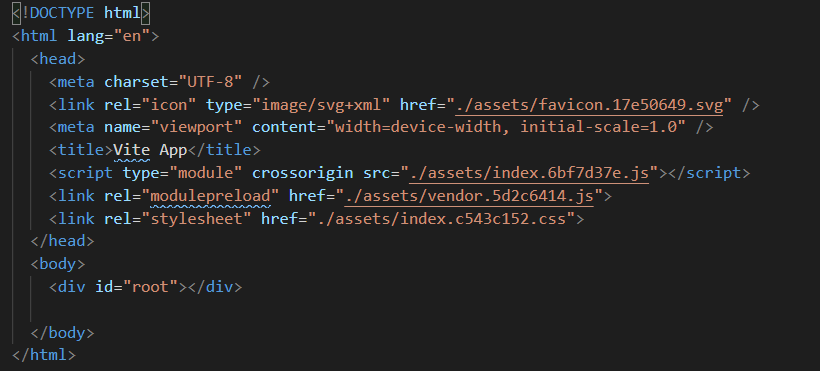

如果有些静态文件不想被hash，只是想用url，可以自定义一个[public文件夹](https://cn.vitejs.dev/guide/assets.html#the-public-directory)

## 环境变量

先看看`package.json`里面的打包命令：

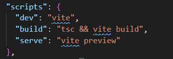

就这三个，`npm run dev`（env=development）、`npm run serve`(本地预览服务env=production)、`npm run build`(env=production)

现在添加一个test环境：

1. 与/src同级新增加一个`.env.test`文件，添加以下内容

   ```javascript
   NODE_ENV=test
   ```

2. `package.json`文件添加打包命令

   ```javascript
   "scripts": {
       "dev": "vite",
       "build": "tsc && vite build",
       "test": "tsc && vite build --mode test", // 这个命令
       "serve": "vite preview"
     },
   ```

3. 执行打包命令`npm run test`，`process.env.NODE_ENV`的值就为test了

## 路由

### 安装

`npm install react-router-dom --save-dev`

[react-router-dom英文官网](https://reactrouter.com/web/guides/quick-start)

### 使用

#### 页面创建

**先建几个页面组件：`home/home.tsx`、`about/about.tsx`、`login/login.tsx`、`user/user.tsx`、`404/404.tsx`**

home.tsx

```tsx
import { withRouter,Link } from 'react-router-dom'
function Home(props: any) {
  return (
    <div className="Home">
      <p>home</p>
      <Link to='/user'>user</Link><br/>
      <Link to='/user?id=1111'>user(search)</Link><br/> // search传参
      <Link to={{ pathname: '/user', search: 'id=123' }}>user(search)</Link><br/> // search传参
      <Link to={{ pathname: '/user', state: { num: '002' } }}>user(state)</Link><br/> // state传参
      <Link to={{pathname: '/user', query: {num: '003'}}}>user(query)</Link><br/> // query传参
    </div>
  )
}

export default withRouter(Home)
```

login.tsx

```tsx
import { withRouter } from 'react-router-dom'
function Login(props:any) {
  const login = () => { 
    let redirect = decodeURIComponent(props.location.search.split('redirect=')[1]).split('&')
    let path = redirect[0] // 登录成功后重定向的路由
    const data = JSON.parse(redirect[1]) // 登录成功后重定向的路由参数，可能是search，可能是state，也许是query，没做params的传参，可查看routerConfig.tsx文件里面重定向登录页的配置
    sessionStorage.setItem('token', '123')
    props.history.replace({pathname:path,...data})
  }
  return (
    <div className="login">
      login
      <button onClick={() => { 
        login()
      }}>登录</button>
    </div>
  )
}

export default withRouter(Login)
```

about.tsx及user.tsx、404.tsx基本差不多

```tsx
import { withRouter } from 'react-router-dom'
function User(props:any) {
  return (
    <div className="User">
      user
    </div>
  )
}

export default withRouter(User)
```

因为采用的是函数式组件，如果组件中需要`history`方法的话：

1. 需借助`react-router-dom`的高阶组件中的`withRouter`，作用是将一个组件包裹进`Route`里面, 然后`react-router`的三个对象`history, location, match`就会被放进这个组件的`props`属性中。

2. 使用react-router-dom的hooks方法`useHistory`,这个方法只返回history，其他location等有相关的hooks方法，[react-router-dom英文官网](https://reactrouter.com/web/guides/quick-start)

   ```tsx
   import { useHistory } from "react-router-dom";
   function HomeButton() {
     let history = useHistory();
     function handleClick() {
       history.push("/home");
     }
     return (
       <button type="button" onClick={handleClick}>
         Go home
       </button>
     );
   }
   ```

   

**路由配置文件：`router/router.ts`及`routerConfig.tsx`**

我还是参考vue的路由格式来，配置router.tsx，引入`react-router-dom`，红色波浪线提示：

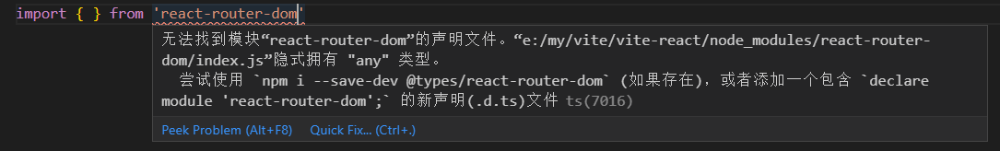

此时需要在vite-react根目录新建一个typing.d.ts文件作为全局的声明文件，并做如下配置：

```typescript
declare module 'react-router-dom'
```

然后在`tsconfig.json`文件中`include`添加：

```json
{
      // 其他配置
  "include": [
      // 其他配置
    "./typing.d.ts"
    ]
}

```

波浪线消失。

为了方便组件的引入，我们配置一个别名，像vue一样：

```typescript
import { defineConfig } from 'vite'
import react from '@vitejs/plugin-react'
const path = require("path");

// https://vitejs.dev/config/
export default defineConfig({
    // ...
  resolve: {
    alias: {
      '@':path.resolve(__dirname, "src")
    }
  }
})
```

在router.tsx中引入组件:

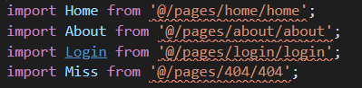

此时又有了红色波浪线，处理方式同`react-router-dom`，在typing.d.ts文件内：

```typescript
declare module 'react-router-dom'
declare module '@/*'
```

#### 路由配置router.ts

完整的router.ts，react的`Suspense`+`lazy`组合实现路由懒加载

```typescript
import React from 'react'
// 组件
const Home = React.lazy(() => import('@/pages/home/home')) // 路由懒加载，配合App.tsx的Suspense
const About = React.lazy(() => import('@/pages/about/about'))
const Login = React.lazy(() => import('@/pages/login/login'))
const User = React.lazy(() => import('@/pages/user/user'))
const Miss = React.lazy(() => import('@/pages/404/404'))

const routerMap:any[] = [
  {
    path: '/',
    redirect: '/home',
    auth: false,
    footerShow: true
  },
  {
    path: '/home',
    component: Home,
    auth: false,
    footerShow: true
  },
  {
    path: '/about',
    component: About,
    auth: false,
    footerShow: true
  },
  {
    path: '/login',
    component: Login,
    auth: false,
    footerShow: false
  },
  {
    path: '/user',
    component: User,
    auth: true,
    footerShow: false
  },
  {
    path: '/404',
    component: Miss,
    auth: false,
    footerShow: false
  },
]

export default routerMap
```

#### 路由权限校验配置routerConfig.tsx

routerConfig.tsx

```tsx
import { Route,Redirect,withRouter } from 'react-router-dom';
import routerMap from './router'

const BasicRoute = (props:any) => {
  const pathname = props.location.pathname
  const targetRouter = routerMap.find((item: any) => item.path === pathname);
  const isLogin = sessionStorage.getItem('token')
  if (!targetRouter) { // 页面不存在
    return <Redirect to="/404" />
  }
  if (targetRouter && targetRouter.redirect) { // 重定向
    return <Redirect to={targetRouter.redirect} />
  }
  if (targetRouter && !targetRouter.auth) { // 无需登录
    return  <Route exact path={targetRouter.path} component={targetRouter.component}/>
  }
  if (targetRouter.auth) { // 要登录授权
    if (isLogin) {
      return <Route exact path={targetRouter.path} component={targetRouter.component} />
    } else { 
      let redirect = pathname
      const query = JSON.stringify(props.location?.query)
      const state = JSON.stringify(props.location?.state)
      const search = props.location?.search
      if (query) { // query传参
        redirect += `&{"query":${query}}`
      }
      if (state) { // state传参
        redirect += `&{"state":${state}}`
      }
      if (search) { // search传参
        redirect += `&{"search":"${search}"}`
      }
      redirect = encodeURIComponent(redirect)
      return <Redirect to={`/login?redirect=${redirect}`} />
    }
  }
};

// exact ：精确匹配
export default withRouter(BasicRoute);
```

因为没有像vue-router一样的导航守卫，所以权限验证也得自己配置，包括404页面。基础的路由及权限差不多完成了。

App.tsx：有那么点像vue的样子了

```tsx
import { Switch ,NavLink,withRouter} from 'react-router-dom';
import RouterView from '@/router/routerConfig'
import {useState,useEffect,Suspense} from 'react'
import routerMap from './router/router'
import './App.css'

function App(props:any) {
  const [footerShow, setFooterShow] = useState(false)
  const routerChange = () => {
    const targetRouter = routerMap.find((item: any) => item.path === props.location.pathname);
    setFooterShow(targetRouter?.footerShow)
  }
  useEffect(() => {
    routerChange()
  }, [props.location])
  return (
    <div className="page">
      <div className="content">
        <Suspense fallback={<div>Loading...</div>}> {/*配合router.ts的lazy懒加载*/}
          <Switch>
            <RouterView />
          </Switch>
        </Suspense>
      </div>
      {footerShow ? <div className="footer">
        <NavLink to="/home" className="item">首页</NavLink>
        <NavLink to="/about" className="item">关于</NavLink>
      </div> : ''}
    </div>
  )
}

export default withRouter(App)

```

main.tsx：添加了`BrowserRouter`

```tsx
import React from 'react'
import ReactDOM from 'react-dom'
import { BrowserRouter} from 'react-router-dom';
import './index.css'
import App from './App'

ReactDOM.render(
  <React.StrictMode>
    <BrowserRouter>
      <App />
    </BrowserRouter>
  </React.StrictMode>,
  document.getElementById('root')
)
```

#### 路由传参方式

```tsx
import { withRouter,Link } from 'react-router-dom'
function Home(props: any) {
  return (
    <div className="Home">
      <p>home</p>
      <Link to='/user'>user</Link><br/>
      <Link to='/user?id=1111'>user(search)</Link><br/> // search传参
      <Link to={{ pathname: '/user', search: 'id=123' }}>user(search)</Link><br/> // search传参 {/** /user?id=123 **/}
      <Link to={{ pathname: '/user', state: { num: '002' } }}>user(state)</Link><br/> // state传参
      <Link to={{pathname: '/user', query: {num: '003'}}}>user(query)</Link><br/> // query传参
      // 函数传参
      <button onClick={() => props.history.push({pathname:"/user",search:'123456'})}>通过函数跳转</button> {/** /user?123456 **/}
  	  <button onClick={() => this.props.history.push({pathname:"/user",state: { num : '002' }})}>通过函数跳转detail组件</button>
      <button onClick={() => props.history.push({pathname:"/user",query: { num : '002' }})}>通过函数跳转detail组件</button>
    </div>
  )
}

export default withRouter(Home)
```

> 1. query传参
>    优点:传递参数可传对象； 缺点:刷新地址栏，参数丢失
> 2. state传参
>    优点:传递参数可传对象； 缺点:刷新地址栏，参数丢失
> 3. params传参
>    优点:刷新地址栏，参数依然存在 缺点:只能传字符串，并且，如果传的值太多的话，url会变得长而丑陋。(对象可以转字符串传递)
> 4. search传参
>    优势:刷新地址栏，参数依然存在 缺点:只能传字符串，并且，如果传的值太多的话，url会变得长而丑陋。(对象可以转字符串传递)

#### 导航守卫- 离开前确认

```typescript
import { useState } from 'react'
import { withRouter,Prompt } from 'react-router-dom'
function User(props: any) {
  const [leave, setLeave] = useState(true)
  return (
    <div className="User">
      user
      <Prompt message={() => { 
        if (!leave) { 
          return true
        }
        const r = confirm('确定离开？')
        return r
      }} when={leave}></Prompt>
    </div>
  )
}

export default withRouter(User)
```

> 1. message：string/function，function默认都返回false，表示继续停留在当前页面。
> 2. when：boolean，true要提示，false不提示

大概这样子：

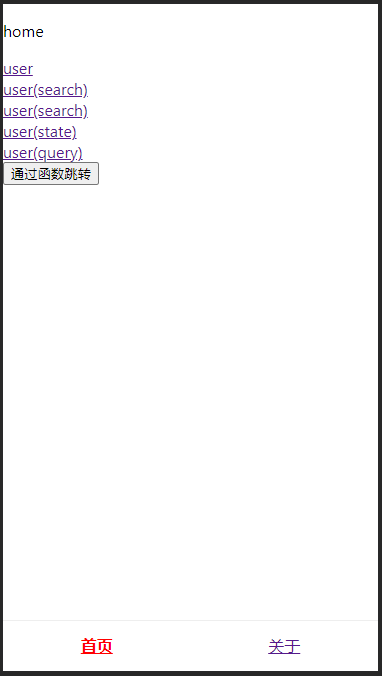

## axios通信

### 安装

`npm install axios`

### 使用

新建文件：

1. `apiNames.ts`：接口名称文件

   ```typescript
   export default {
     entrustStorageExport: '/exportDetails', //下载
     commonUpload: '/upload', // 上传图片
     PageCustomService: '/support', // 客服信息get
     loginUserResetPassword: '/resetPassword', // 重置密码post
   }
   ```

   

2. `axios.ts`：axios请求封装文件

   ```typescript
   import request from './axiosConfig';
   import { sessions } from '@/utils/utils'
   
   interface api { 
     url: string
     data?: any
     header?:any
   }
   
   const httpConfig = (method:string,params?:any) => { 
     let token = sessions.get(`token`)
     let data: any = null
     if (method !== 'FILE') { // 非文件上传
       if (method === 'POST' || method === 'PUT') {
         data = {
           data: params.data,
         }
       } else if (method === 'GET' || method === 'DELETE') {
         data = {
           params: params.data,
         }
       }
       return new Promise((resolve, reject) => {
         request(params.url, {
           method,
           ...data,
           headers: {
             'Content-Type': 'application/json;charset=UTF-8',
             'Authorization': token ? token : 'Basic aHc6aHc=',
             ...params.header
           }
         }).then((res:any) => { 
           resolve(res)
         }).catch((err:any)=>{
           console.log(err,'异常')
         })
       })
   
     } else { // 文件上传
       return new Promise((resolve, reject) => {
         request(params.url, {
           method: 'post',
           data: params.data,
           requestType: 'form',
           headers: {
             'Authorization': token ? token : 'Basic aHc6aHc='
           }
         }).then((res:any) => { 
           resolve(res)
         }).catch((err:any)=>{
           console.log(err,'异常')
         })
       })
     }
   
   }
   
   export default {
     post: (params: api) => {
       return httpConfig('POST', params)
     },
     get: (params:api) => {
       return httpConfig('GET', params)
     },
     delete: (params:api) => {
       return httpConfig('DELETE', params)
     },
     put: (params:api) => {
       return httpConfig('PUT', params)
     },
     file: (params:api) => {
       return httpConfig('FILE', params)
     },
   }
   ```

   

3. `axiosConfig.ts`：axios配置文件

   ```typescript
   /**
    * axios 网络请求工具
    */
   import axios from 'axios';
   import api from './apiNames'
   import url from './url'
   
   // 服务器状态码
   const codeMessage:any = {
     200: '服务器成功返回请求的数据。',
     201: '新建或修改数据成功。',
     202: '一个请求已经进入后台排队（异步任务）。',
     204: '删除数据成功。',
     400: '发出的请求有错误，服务器没有进行新建或修改数据的操作。',
     401: '用户没有权限（令牌、用户名、密码错误）。',
     403: '用户得到授权，但是访问是被禁止的。',
     404: '发出的请求针对的是不存在的记录，服务器没有进行操作。',
     406: '请求的格式不可得。',
     410: '请求的资源被永久删除，且不会再得到的。',
     422: '当创建一个对象时，发生一个验证错误。',
     500: '服务器发生错误，请检查服务器。',
     502: '网关错误。',
     503: '服务不可用，服务器暂时过载或维护。',
     504: '网关超时。',
   };
   // 接口返回状态码
   const apiCode: any = {
     toast: 101, // 错误信息，需要toast提示
     loginFail: 10086, // 登录失效
   }
   
   let request = axios.create({
     baseURL: url,
     timeout: 2e4,
     responseType: 'json',
   });
   /**
    * 异常处理程序
    */
   const errorHandler = (response: any) => {
     if (response && response?.status) {
       const errorText = codeMessage[response.status] || response.statusText;
       const { status, url } = response;
       if (response?.status === 401) { // 登录失效
         setTimeout(() => {
           window.sessionStorage.clear();
           window.location.href = `${window.location.origin}/login`;
         }, 1e3);
       } else {
         console.log(`请求错误 ${status}: ${url},${errorText}`);
       }
     }
     return response;
   };
   
   // 过滤导出excel错误提示，文件流下载接口声明列表
   const list = [
     { url: api.entrustStorageExport, type: 'export', export: 1},
   ];
   
   // 添加请求拦截器
   request.interceptors.request.use((config:any) => {
     const finds = list.find(item => config.url.includes(item.url));
     const num = config[config.method.toUpperCase() === 'GET' ? 'params' : 'data']?.export || 0;
     if (finds && num === 1) { // 下载
       config.responseType = 'blob'
     }
     
     return config
   }, (error: any) => {
       console.log(error)
   })
   
   // 添加响应拦截器
   request.interceptors.response.use(async (response: any) => {
     const options = response.config
     const finds = list.find(item => options.url.includes(item.url));
     const num = options[options.method.toUpperCase() === 'GET' ? 'params' : 'data']?.export || 0;
     if (finds && num === 1 && response.status === 200) { // 文件流下载，请求中必须含：export：1，可选fileName，默认时间
       const blob = new Blob([response.data], {type: 'application/vnd.ms-excel'});
       let filename = options[options.method.toUpperCase() === 'GET' ? 'params' : 'data']?.fileName || new Date().Format('YYYY-MM-DD hh:mm:ss');
       if(window.navigator.msSaveOrOpenBlob) {// 兼容IE10
         navigator.msSaveBlob(blob,filename);
       } else {
         // 创建一个超链接，将文件流赋进去，然后实现这个超链接的单击事件
         const elink = document.createElement('a');
         elink.download = filename;
         elink.style.display = 'none';
         elink.href = URL.createObjectURL(blob);
         document.body.appendChild(elink);
         elink.click();
         URL.revokeObjectURL(elink.href); // 释放URL 对象
         document.body.removeChild(elink);
       }    
       return blob
     }
     if (response.status === 200) { // 一般性接口请求
       try {
         if (response.data.code) {
           if (response.data.code !== 200) {
             if (response.data.code === apiCode.loginFail) { // 登录失效
               setTimeout(() => {
                 window.sessionStorage.clear();
                 window.location.href = `${window.location.origin}/login`;
               }, 1e3);
             }
             if (response.data.code === apiCode.toast) {
               alert(response.data.errorMsg);
             } else { 
               console.log(response.data.errorMsg);
             }
           }
         }
   
       } catch (err) {
         console.log('接口请求失败');
       }
     } else {
       errorHandler(response)
     }
     return response.data;
   });
   
   export default request
   ```

   

4. `url.ts`：接口路径配置文件

   ```typescript
   let url = ''
   switch (process.env.NODE_ENV) { 
     case 'development': url = "http://127.0.0.1:9999"; break;
     case 'test': url = "http://127.0.0.1:9999"; break;
     default:  url = "http://127.0.0.1:9999"; break;
   }
   export default url
   ```

5. user文件夹下新建`services.ts`

   ```typescript
   import request from '@/axios/axios'
   import api from '@/axios/apiNames'
   
   
   // 获取服务信息
   export const getPageCustomService = () => { 
       let params = {
         url: api.PageCustomService
       }
     return request.get(params)
   }
   // 重置密码
   export const resetPassword = (name:any) => { 
     let params = {
       url: api.loginUserResetPassword,
       data: {
         name
       }
     }
     return request.post(params)
   }
   // 上传图片
   export const uploadImage = (formData:any) => { 
     let params = {
       url: api.commonUpload,
       data: formData
     }
     return request.file(params)
   }
   
   // 导出申请清单
   export const exportUrl = () => { 
     let params = {
       url: api.entrustStorageExport,
       data: {
         id: 4,
         fileName: '申请商品明细.xls',
         export: 1,
       }
     }
     return request.get(params)
   }
   ```

   

6. 修改user.tsx

   ```tsx
   import { useState,useEffect } from 'react'
   import { withRouter, Prompt, useHistory } from 'react-router-dom'
   import {
     getPageCustomService,
     resetPassword,
     uploadImage,
     exportUrl
   } from './services'
   
   function User(props: any) {
     const [leave, setLeave] = useState(true)
     let history = useHistory()
     console.log(history)
   
     useEffect(() => {
       getData()
     }, [])
   
     // get请求
     const getData = async () => { 
       let { data, code } = await getPageCustomService()
       console.log(data,code)
     }
     // post请求
     const postData = async () => {
       let { code, data } = await resetPassword("gdtest002")
       console.log(code,data)
     }
     // 图片上传
     const [file, setFile] = useState(null) as any
     const imageUpload = async () => {
       if (!file) { 
         return
       }
       if (file?.size > 2 * 1024 * 1024) {
         alert('大了')
         return
       }
       let formData = new FormData();
       const fileName = props.name || 'file';
       formData.append(fileName, file);
       let {code,data} = await uploadImage(formData)
       console.log(code,data)
     }
     // 导出/下载文件流
     const exportData = async () => {
       let data = await exportUrl()
       console.log(data)
     }
   
     return (
       <div className="User">
         user
         <p>
           <button onClick={() => { postData() }}>post请求</button>
         </p>
         <p>
           <button onClick={() => { history.replace('/about') }}>点我去about</button>
         </p>
         <p>
           <button onClick={() => {exportData()}}>点我下载</button>
         </p>
         <p>
           <input type="file" onChange={(e:any) => {setFile(e.target.files[0])}}/>
           <button onClick={() => {imageUpload()}}>点我上传</button>
         </p>
         <Prompt message={() => { 
           if (!leave) { 
             return true
           }
           const r = confirm('确定离开？')
           return r
         }} when={leave}></Prompt>
       </div>
     )
   }
   
   export default withRouter(User)
   ```

   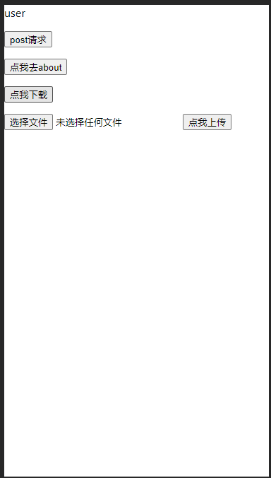


## 状态管理

## CSS及LESS

## 移动端单位换算

## 组件

## UI

## typing.d.ts

全局的声明文件

格式：

```typescript
declare module '***'
```


## vite.config.ts

### 配置别名

```typescript
import { defineConfig } from 'vite'
import react from '@vitejs/plugin-react'
const path = require("path");

// https://vitejs.dev/config/
export default defineConfig({
    // ***
  resolve: {
    alias: {
      '@':path.resolve(__dirname, "src")
    }
  }
})
```


